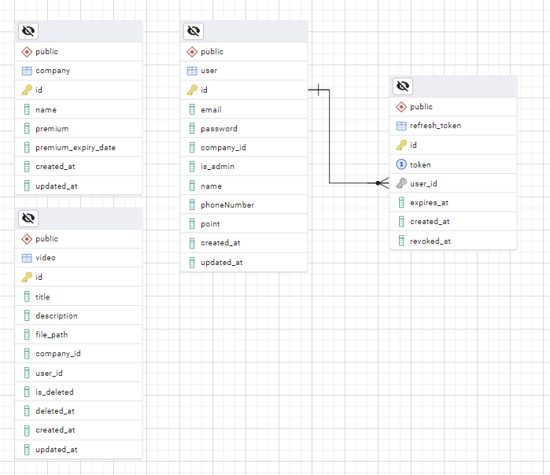

# media_resource project
 동영상 리로스를 관리하는 서버 구현

## 프로젝트 실행 방법

```bash
[1] docker compose build

[2] docker swarm init

[2-1]
export POSTGRES_USER=postgres
export POSTGRES_PASSWORD=postgres
export POSTGRES_DB=lumanlab

윈도우 일 경우 
set POSTGRES_USER=postgres
set POSTGRES_PASSWORD=postgres
set POSTGRES_DB=lumanlab

[3] docker stack deploy -c docker-compose.yml lumanlab
    # docker stack rm lumanlab => 삭제 , docker volume rm lumanlab_postgres_data => 삭제

[4] docker service ls => 서비스 상태 확인

```

### 답변 사항

<서버에서 직접 파일을 읽어 응답 하는 형식 과 S3 같은 스토리지 서비스의 URL로 전달 하는 방식의 장 단점>

① 파일을 백엔드가 직접 Response(스트리밍)하는 방식

- 토큰 검증, 권한 체크, 요금제 확인 같은 비즈니스 로직을 매요청마다 강제 할 수 있고 영상 접근 및 보안도 어플리케이션 레이어에 전부 남으로써 단일 지점에서 끝난다. 하지만 단점은 영상 파일이 클수록 서버에 부하가 많이 걸리고 스케일링에 부담이 갈 수 있다.

② S3 URL 전달

- 가장 큰 장점은 비용 효율 & 고가용성이라고 생각합니다. 실제 영상 업로드의 네트워크는 S3 CloudFront 를 통해 전달 됩니다. 특히 백엔드 로드 없이 바로 업 다운로드 가능하므로 서버 부하가 획기적으로 줄어 듭니다 하지만 단점이라고 하면 유로 영상 같은 경우 URL 유출(짧은 TTL·서명에 IP나 객체 크기 제약을 걸어 완화할 수 있지만, 즉시 철회(revoke)등 제약이 있을수도 있습니다.)에 신경 써야 하며 초기 클라이언트 구현에 부담이 있습니다.

<포인트를 주는 API의 경우 동시성 이슈 해결 방법>

선택 이유

동시에 두 번 적립해도 한 트랜잭션만 커밋되므로 포인트 합계가 정확하다.

NOWAIT + lock_timeout 조합 “절대 기다리지 않는다”→ 실패한 요청은 즉시 클라이언트 재시도로 전가. 대량 이벤트(예: 동일 유저로 초당 수십 콜)에서도 DB 커넥션이 락 대기로 묶이지 않는다.

행 단위 잠금이라 범위가 좁다. 다른 유저 포인트 적립은 전혀 막지 않는다.

### ERD




### 프로젝트 구조 그래프

```
company-service/
├── .vscode/
│   └── launch.json        # VS Code 디버깅 설정
├── api/
│   └── company.py         # 회사 관련 API 라우터
├── core/
│   ├── config.py          # 설정 관리
│   ├── db/
│   │   ├── base.py        # 데이터베이스 연결 설정
│   │   ├── models.py      # 데이터베이스 모델
│   │   └── schemas.py     # Pydantic 스키마
│   └── dep.py             # 의존성 함수
├── crud/
│   └── company.py         # 회사 CRUD 작업
├── services/
│   └── company_service.py # 회사 관련 서비스 로직
├── Dockerfile             # 도커 이미지 빌드 설정
├── main.py                # 애플리케이션 진입점
├── requirements.txt       # 의존성 패키지 목록
└── wait-for-it.sh         # 서비스 시작 전 DB 연결 대기 스크립트
```
```
user-service/
├── .vscode/
│   └── launch.json        # VS Code 디버깅 설정
├── api/
│   ├── deps.py            # API 의존성 함수
│   └── user.py            # 사용자 관련 API 라우터
├── core/
│   ├── auth.py            # 인증 관련 유틸리티
│   ├── config.py          # 설정 관리
│   └── db/
│       ├── base.py        # 데이터베이스 연결 설정
│       ├── models.py      # 데이터베이스 모델
│       └── schemas.py     # Pydantic 스키마
├── crud/
│   ├── token.py           # 토큰 CRUD 작업
│   └── user.py            # 사용자 CRUD 작업
├── Dockerfile             # 도커 이미지 빌드 설정
├── main.py                # 애플리케이션 진입점
├── requirements.txt       # 의존성 패키지 목록
└── wait-for-it.sh         # 서비스 시작 전 DB 연결 대기 스크립트
```
```
video-service/
├── .vscode/
│   └── launch.json        # VS Code 디버깅 설정
├── api/
│   └── video.py           # 비디오 관련 API 라우터
├── core/
│   ├── config.py          # 설정 관리
│   ├── db/
│   │   ├── base.py        # 데이터베이스 연결 설정
│   │   ├── models.py      # 데이터베이스 모델
│   │   └── schemas.py     # Pydantic 스키마
│   ├── dep.py             # 의존성 함수
│   └── utils/
│       └── file_utils.py  # 파일 처리 유틸리티
├── crud/
│   └── video.py           # 비디오 CRUD 작업
├── Dockerfile             # 도커 이미지 빌드 설정
├── main.py                # 애플리케이션 진입점
├── requirements.txt       # 의존성 패키지 목록
└── wait-for-it.sh         # 서비스 시작 전 DB 연결 대기 스크립트
```

